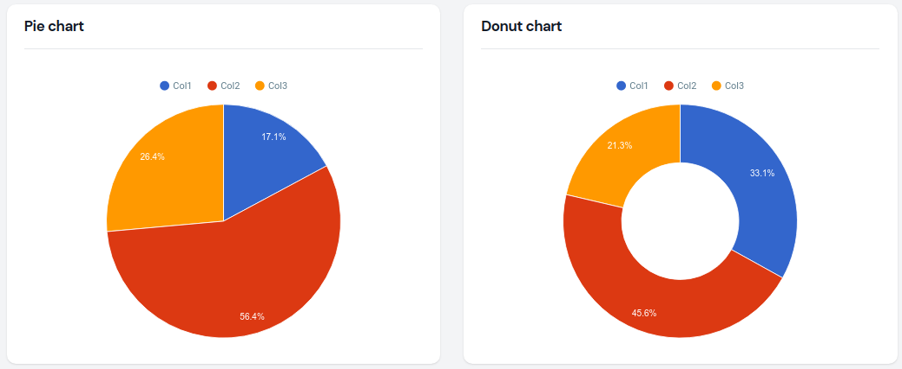

# Filament Google Charts Widgets


Create chart widgets using [Google Charts](https://developers.google.com/chart).

## Installation

You can install the package into a Laravel app that uses [Filament](https://filamentphp.com) via composer::

```bash
composer require arbermustafa/filament-google-charts-widgets
```

**Filament V2** - if you are using Filament v2.x, you can use [this section](https://github.com/arbermustafa/filament-google-charts-widgets/tree/1.0.8)

You can publish the config file with:

```bash
php artisan vendor:publish --tag=filament-google-charts-widgets-config
```

The `config` file contains default global customization options for better charts rendering in light/dark theme based on the great work of [Weekdone](https://github.com/weekdone/GoogleChartStyles)

Optionally, you can publish the view using:

```bash
php artisan vendor:publish --tag=filament-google-charts-widgets-views
```

## Usage

### Pie chart

```php
use ArberMustafa\FilamentGoogleCharts\Widgets\PieChartWidget;

class DemoPieChart extends PieChartWidget
{
    protected static ?int $sort = 1;

    protected static ?array $options = [
        'legend' => [
            'position' => 'top',
            'alignment' => 'center',
        ],
        'height' => 400,
        'is3D' => false,
    ];

    protected function getHeading(): string
    {
        return 'Pie chart';
    }

    protected function getData(): array
    {
        return [
            ['Label', 'Aggregate'],
            ['Col1', 7.2],
            ['Col2', 23.7],
            ['Col3', 11.1],
        ];
    }
}
```

### Donut chart

```php
use ArberMustafa\FilamentGoogleCharts\Widgets\DonutChartWidget;

class DemoDonutChart extends DonutChartWidget
{
    protected static ?string $heading = 'Donut chart';

    protected static ?int $sort = 2;

    protected static ?float $pieHole = 0.5;

    protected static ?array $options = [
        'legend' => [
            'position' => 'top',
        ],
        'height' => 400,
    ];

    protected function getData(): array
    {
        return [
            ['Label', 'Aggregate'],
            ['Col1', 17.2],
            ['Col2', 23.7],
            ['Col3', 11.1],
        ];
    }
}
```



## Available chart types

Below is a list of available chart widget classes which you may extend, and their corresponding Google Charts documentation page, for inspiration what to return from getData():

-   `ArberMustafa\FilamentGoogleCharts\Widgets\AreaChartWidget` - [Google Charts documentation](https://developers.google.com/chart/interactive/docs/gallery/areachart#configuration-options)
-   `ArberMustafa\FilamentGoogleCharts\Widgets\BarChartWidget` - [Google Charts documentation](https://developers.google.com/chart/interactive/docs/gallery/barchart#configuration-options)
-   `ArberMustafa\FilamentGoogleCharts\Widgets\ColumnChartWidget` - [Google Charts documentation](https://developers.google.com/chart/interactive/docs/gallery/columnchart#configuration-options)
-   `ArberMustafa\FilamentGoogleCharts\Widgets\DonutChartWidget` - [Google Charts documentation](https://developers.google.com/chart/interactive/docs/gallery/piechart#donut)
-   `ArberMustafa\FilamentGoogleCharts\Widgets\LineChartWidget` - [Google Charts documentation](https://developers.google.com/chart/interactive/docs/gallery/linechart#configuration-options)
-   `ArberMustafa\FilamentGoogleCharts\Widgets\PieChartWidget` - [Google Charts documentation](https://developers.google.com/chart/interactive/docs/gallery/piechart#configuration-options)

## Live updating (polling)

By default, chart widgets refresh their data every 5 seconds.

To customize this, you may override the `$pollingInterval` property on the class to a new interval:

```php
protected static ?string $pollingInterval = '10s';
```

Alternatively, you may disable polling altogether:

```php
protected static ?string $pollingInterval = null;
```

## Chart configuration options

You may specify an `$options` variable on the chart class to control the many configuration options that the [Google Charts](https://developers.google.com/chart) library provides. For instance, you could change the position off the legend for PieChartWidget class and set a custom height:

```php
protected static ?array $options = [
        'legend' => [
            'position' => 'bottom',
        ],
        'height' => 300,
    ];
```

## Changelog

Please see [CHANGELOG](CHANGELOG.md) for more information on what has changed recently.

## Contributing

If you want to contribute to this package, you may want to test it in a real Filament project:

-   Fork this repository to your Github account.
-   Create a Filament app locally.
-   Clone your fork in your Filament app root directoy.
-   In the `/filament-google-charts-widgets` directory, create a branch for your fix/improvement, e.g. `fix/pie-chart`.

Install the packages in your app's `composer.json`:

```json
"require": {
    "arbermustafa/filament-google-charts-widgets": "dev-fix/pie-chart as dev-main",
},
"repositories": [
    {
        "type": "path",
        "url": "./filament-google-charts-widgets"
    }
]
```

Now run `composer update`.

Please see [CONTRIBUTING](.github/CONTRIBUTING.md) for details.

## Security Vulnerabilities

Please review [our security policy](../../security/policy) on how to report security vulnerabilities.

## Credits

-   [Arber Mustafa](https://github.com/arbermustafa)
-   [Google Web Components](https://github.com/GoogleWebComponents/google-chart)
-   [Weekdone](https://github.com/weekdone/GoogleChartStyles)
-   [All Contributors](../../contributors)

## License

The MIT License (MIT). Please see [License File](LICENSE.md) for more information.
